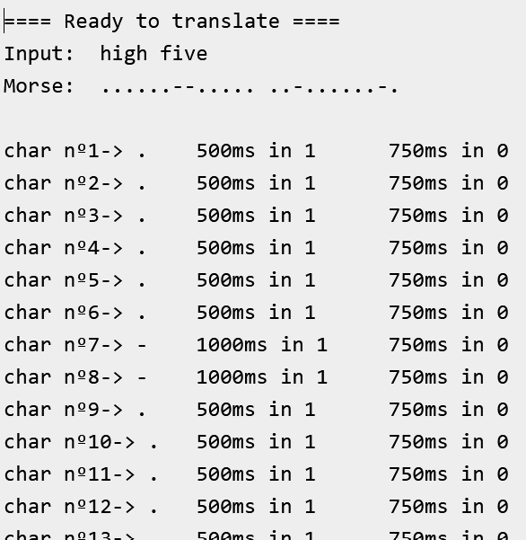
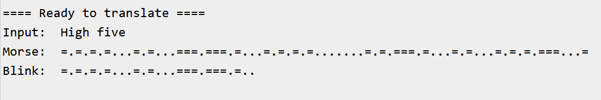

# Différences entre les versions

## Version 2 sur Arduino

La première à avoir été faite. La classe `morseTranslator` renvoie une représentation du code morse avec des **points** (clignotements **courts**) et des **tirets** (clignotements **longs**).  

La visualisation dans le terminal serial est:

## Version 3 sur Arduino

Cette version est un poil plus complexe en termes de codage (dans la classe `morseTranslator`) mais de plus facile utilisation dans le fichier `main.ino`.  
La classe `morseTranslator` renvoie une représentation du code morse comme un signal temporel de l'état de la led: =.===.=...===.=  

La visualisation dans le terminal serial est:

