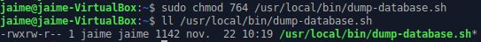
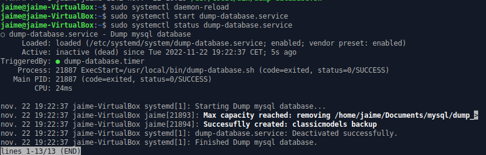
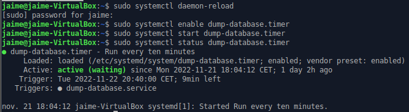

# Configurer le script en tant que service

<!-- https://tecadmin.net/run-shell-script-as-systemd-service -->

## Étape 1

Faire le script bash exécutable:
```shell
$ sudo chmod 764 /path/to/dump-database.sh
```



Pour que le script puisse utiliser la commande `mysqldump` sans mettre de mot de passe  et pour que le service puisse s'exécuter correctement:

```shell
$ mysql -u root -p
mysql> ALTER USER jaime@localhost IDENTIFIED WITH auth_socket;
mysql> GRANT PROCESS ON *.* TO jaime@localhost;
```

## Étape 2

Créer le fichier [`dump-database.service`](dump-database.service) et le sauvegarder dans `/lib/systemd/system/`

On ajoute:

```service
[Unit]
Description=Dump mysql database
After=network.target

[Service]
WorkingDirectory=/home/jaime
User=jaime
ExecStart=/usr/local/bin/dump-database.sh
Type=oneshot
```

Et pour que le service puisse exécuter le script bash on ajoute la permission d'exécuter:

## Étape 3

Activer le nouveau service

Le service a été ajouté au dossier. Il faut recharger le *systemctl daemon* pour lire le nouveau fichier.
Il faudra le recharger chaque fois que `dump-database.service`sera modifié.
```shell
$ sudo systemctl daemon-reload
```

Maintenant on active le service et on le démarre.
```shell
$ sudo systemctl start dump-database.service
```

On peut vérifier que le script fonctionne en tant que service avec
```shell
$ sudo systemctl status dump-database.service
```



## Timer

On créer le fichier [`dump-database.timer`](dump-database.timer) qui a le même nom que `dump-database.service`:

```timer
[Unit]
Description=Run every ten minutes

[Timer]
OnCalendar=*-*-* *:00,10,20,30,40,50:00

[Install]
WantedBy=timers.target
```

Et on l'active avec :

```shell
$ sudo systemctl daemon-reload
$ sudo systemctl enable dump-database.timer
$ sudo systemctl start dump-database.timer
$ sudo systemctl status dump-database.timer
```


