# Setup MySQL

<!-- https://appdevtools.com/pastebin/z4VN5K -->

Pour le setup de MySQL j'ai suivi le tutoriel détaillé de [DigitalOcean](https://www.digitalocean.com/community/tutorials/how-to-install-mysql-on-ubuntu-20-04)

## Installer MySQL

Pour installer mysql in faut executer la commande suivante:

```shell
$ sudo apt install mysql-server
```

et pour l'executer:

```shell
$ sudo systemtcl start mysql.service
```

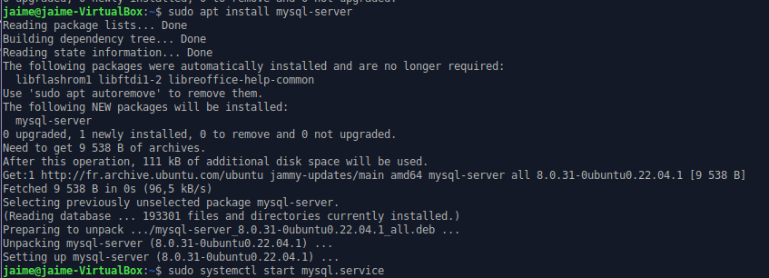

## Configurer MySQL

Nous devons ajouter un mot de passe pour l'utilisateur *root* et ainsi augmenter la sécurité de la base de données.  

```shell
$ sudo mysql
mysql> ALTER USER 'root'@'localhost' IDENTIFIED WITH mysql_native_password BY 'password';
```

``` localhost ``` indique que l'utilisateur ne pourra pas être utilisé en ligne, que sur la machine.

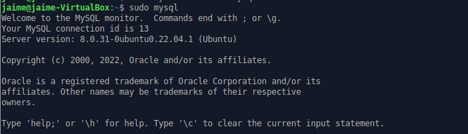

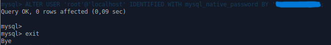

On quite avec:

```shell
mysql> exit
```

---

Maintenant on met on place le type de sécurité de la base de données. On laissera les valeurs par défaut.

```shell
$ sudo mysql_secure_installation
```

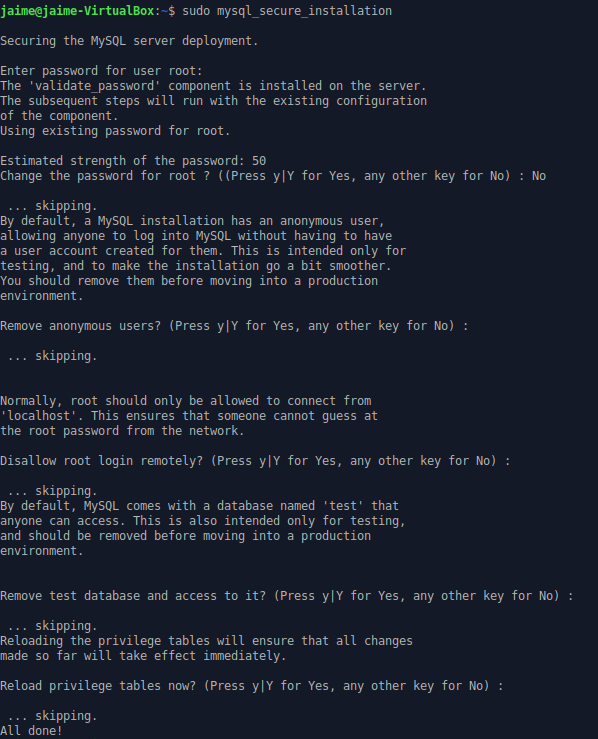

## Création du user MySQL

Ouvrir MySQL:
```shell
$ mysql -u root -p
```

Créer l'utilisateur:
```shell
mysql> CREATE USER 'jaime'@'localhost' IDENTIFIED BY 'password';
```

Lui donner des droits:
```shell
mysql> GRANT PRIVILEGE ON database.table TO 'jaime'@'host';
```

Mais dans ce cas on donnera tous les droits:
```shell
mysql> GRANT ALL PRIVILEGES ON *.* TO 'jaime'@'localhost' WITH GRANT OPTION;
```

Finalement on libère la mémoire qui aurait pu être utilisée temporellement pour créer l'utilisateur.
```shell
mysql> FLUSH PRIVILEGES;
```

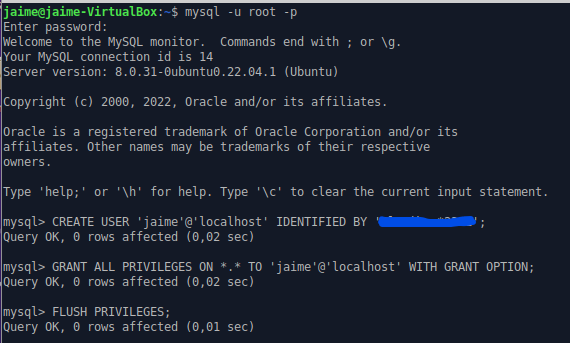

On peut maintenant y accéder avec le nouvel utilisateur:
```shell
$ mysql -u jaime -p
```

Vérifions que MySQL s'exécute correctement:
```shell
$ systemctl status mysql.service
```

On obtient bien que MySQL est en exécution:  
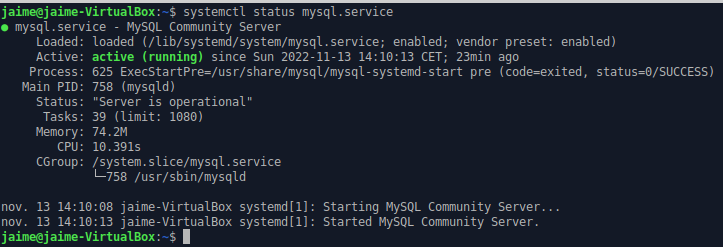  

> Si ce n'est pas le cas on peut l'exécuter avec la commande:
>```shell
>$ sudo systemctl start mysql
>```

## Importer la base de données

L'explication suivante est mon premier essai en suivant l'aide en ligne. Vous trouverez après la bonne exécution.

>Depuis un utilisateur avec des droits, on crée une base de données.
>
>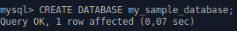  
>
>Puis, depuis le terminal, on importe les données:
>
>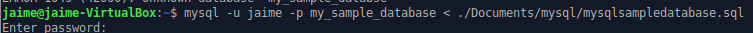  
>Cependant en faisa
>
>On observe que `my_sample_database` apparaît dans les bases de données disponibles.  
>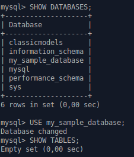
>
>Cependant lorsqu'on fait `SHOW TABLES;` on n'obtient pas de résultat.  
>
>Alors qu'en faisant `SOURCE database.sql;` on obtient bien:  
>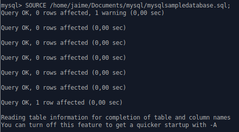
>c

***Solution:***

Je n'avais pas remarqué que la database *classicmodels* avait été créée lors de l'importation du fichier .sql  
J'en ai donc déduit qu'il ne faut créer de base de donnée au préalable  

Tout d'abord on supprime les databases créées:  
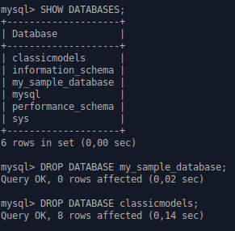  

Puis on importe le fichier `.sql` sans spécifier la database:
```shell
$ mysql -u jaime -p <mysqlsampledatabase.sql
```

et on l'affiche avec 
```shell
mysql> USE classicmodels;
mysql> SHOW TABLES;
```
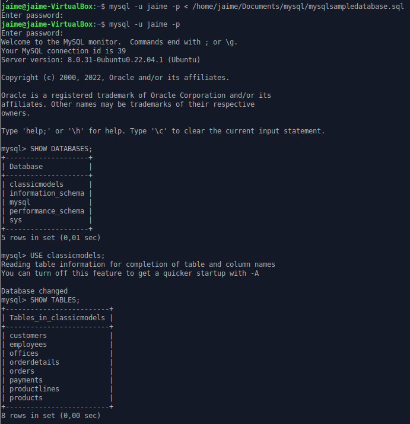

ne pas ajouter password
mysql -u root -p
ALTER USER jaime@localhost IDENTIFIED WITH auth_socket

grant all permission
grant process on *.* to jaime@localhost;

sudo chmod 744 /usr/local/bin/dump-database.sh
